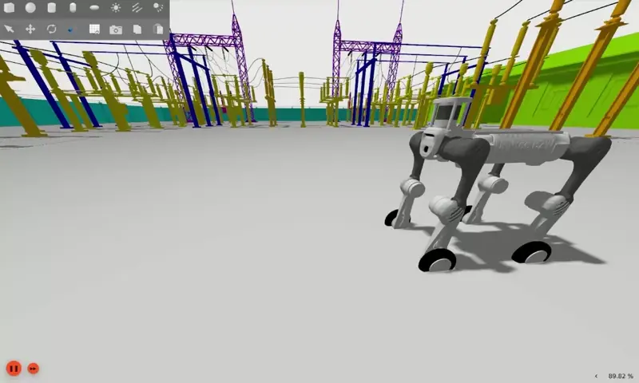

# QRE B2


> [!IMPORTANT]
This ``humble-nvidia`` branch is applicable for the on-board computer of the B2 Edu. 

The following documentation is valid only for B2 Edu version (Tested until 28-May-2023). 
> [B2 Docs](https://www.docs.quadruped.de/projects/b2/html/index.html)

> [!NOTE]
> - v1.0.0 | 12 June 2025
>   1. Initial repository
---

## Code Documentation


> Pull requests are welcomed for updates/enhancements!

- [X] B2 Base High Level Driver
    - [X] B2 Joint State Publisher
    - [X] B2 Odom Publisher
    - [X] B2 Odom tf Publisher
    - [X] B2 IMU Publisher
    - [X] B2 Gait Selection
- [X] B2 Base Low Level Driver Example (Unitree Example suffices)
- [X] B2 Lidar (2D Scan requires further update)
- [X] B2 Description
- [X] B2 Front Camera
- [X] B2 Rear Camera
- [X] B2 Bringup
- [X] B2 Webserver
- [X] B2 Battery State
- [X] B2 Viz
- [X] B2 Control
- [X] B2 SLAM
- [ ] B2 Docking Station
- [X] B2 Odom Navigation
- [X] B2 Map Navigation
- [X] B2 Isaac Sim [B2 Isaac Sim](https://docs.isaacsim.omniverse.nvidia.com/4.1.0/features/environment_setup/assets/usd_assets_robots.html)
- [X] B2 Gazebo Fortress
  - [X] B2 Sim
  - [X] B2W Sim
  - [ ] PID Tuning
  - [ ] Sensor Addition

> [!WARNING]
> Unitree are constantly updating their firmware and at times changing their naming convention which **may** cause breakage in some of the newer firmwares. In that case either submit and issue and/or create a pull request with the correct feature.

## Table of Content

- [QRE B2](#qre-b2)
  - [Code Documentation](#code-documentation)
  - [Table of Content](#table-of-content)
- [Interfacing](#interfacing)
  - [B2 IP Addresses](#b2-ip-addresses)
  - [Static Network Connection](#static-network-connection)
  - [B2 IP Addresses](#b2-ip-addresses-1)
  - [Network Connection](#network-connection)
- [Quick Start](#quick-start)
  - [B2 Drivers Startup](#b2-drivers-startup)
- [B2 Tele-operation](#b2-tele-operation)
- [B2 Mode Activation](#b2-mode-activation)
- [B2 Sensors](#b2-sensors)
  - [Realsense D435i](#realsense-d435i)
    - [Realsense - Configuration](#realsense---configuration)
- [B2 ROS Packages](#b2-ros-packages)
  - [Webserver](#webserver)
  - [Front Camera](#front-camera)
  - [Rear Camera](#rear-camera)
  - [Navigation](#navigation)
    - [Odometric Navigation](#odometric-navigation)
    - [Map Navigation](#map-navigation)
  - [SLAM (Simultaneous Localization and Mapping)](#slam-simultaneous-localization-and-mapping)
  - [Auto-Startup (Optional)](#auto-startup-optional)
  - [Autonomous Vacuum Demo](#autonomous-vacuum-demo)
  - [Gazebo Fortress](#gazebo-fortress)
    - [B2 Simulation](#b2-simulation)
    - [B2W Simulation](#b2w-simulation)
    - [Cleanup After Simulation](#cleanup-after-simulation)
    - [Effort Trajectory Control Example](#effort-trajectory-control-example)
    - [B2W Wheeled Example](#b2w-wheeled-example)
    - [Effort Control Example  (Disabled)](#effort-control-example--disabled)
    - [Position Control Example (Disabled)](#position-control-example-disabled)
    - [Position Trajectory Control Example (Disabled)](#position-trajectory-control-example-disabled)
    - [Xacro to URDF](#xacro-to-urdf)
- [Installation (B2 Nvidia)](#installation-b2-nvidia)
- [Installation (Host PC)](#installation-host-pc)
  - [First Time Setup](#first-time-setup)
  - [After First Time Setup](#after-first-time-setup)
- [Miscellanious](#miscellanious)
  - [Sync host computer and unitree computer](#sync-host-computer-and-unitree-computer)
  - [Save SSH Key](#save-ssh-key)
  - [Camera Stream Via Terminal](#camera-stream-via-terminal)
  - [Latest QRE B2 Updates](#latest-qre-b2-updates)

# Interfacing

## B2 IP Addresses

| Name               | IP Address      | Username | Password    |
| ------------------ | --------------- | -------- | ----------- |
| B2 MCU             | 192.168.123.161 | x        | x           |
| B2 Robosense Lidar | 192.168.123.162 | x        | x           |
| B2 Onboard PC      | 192.168.123.164 | unitree  | Unitree0408 |

Instructions for interfacing with the robot using **Ubuntu 20.04** and **ROS2 Humble**.

> This procedure should be followed after setting up and pairing with the B2 Edu. Furthermore, all of the B2's functionality should be verified via the app. Instructions for set up can be found at [B2 Docs](https://www.docs.quadruped.de/projects/b2/html/index.html). This guide builds upon the information from the docs.

## Static Network Connection
For the first time, one needs to connect through a **LAN** cable to configure the robot's network.

To create a static connection in your PC (not the robots), in Ubuntu go to Settings $\rightarrow$ **Network** then click on **+** and create a new connection.

1. Change the connection to **Manual** in the **IPv4** settings.
2. Set the **Address** IP as **192.168.123.51** and the **Netmask** as **24**.
3. Click save and restart your network.

After a successful connection, check the host's local IP by typing in the Host PC's terminal:
```bash
ifconfig
```


Now, ping the robot:
```bash
ping 192.168.123.164
```


Access the robot via SSH:
```bash
ssh -X unitree@192.168.123.164
```

The default password is:
```bash
Unitree0408
```

## B2 IP Addresses

- 192.168.123.161 -> B2 MCU
- 192.168.123.164  -> B2 Auxiliary PC (Only LAN)


> Sometimes other networks can cause disruptions when connecting to the B2. It is best to have only your connection to the robot active and all others inactive.

## Network Connection

- Connection via LAN

```bash
ssh -X unitree@192.168.123.164
```

# Quick Start

## B2 Drivers Startup

- The drivers should be pre-configured by MBS-Team otherwise please follow the installation for the B2: [Installation (B2 Nvidia)](#installation-b2-nvidia)

- Launch the b2 rviz

```bash
ros2 launch b2_viz view_robot.launch.py
```

# B2 Tele-operation 

- Teleop b2. The Unit name has to be replaced with the b2 version if applied! Can be verified via `ros2 topic list`

```bash
ROS_DOMAIN_ID=10 ros2 run teleop_twist_keyboard teleop_twist_keyboard cmd_vel:=/b2_unit_001/hardware/cmd_vel
ROS_DOMAIN_ID=10 ros2 run teleop_twist_keyboard teleop_twist_keyboard cmd_vel:=/b2_unit_001/controls/cmd_vel
```

# B2 Mode Activation

Available B2 Modes via ROS2 Services:
- damp
- stand_up
- stand_down
- recovery
- stop_move
- gait_idle
- gait_trot
- gait_trot_running
- gait_visualwalk
- gait_flatwalk
- speed_low
- speed_high
- body_height_low
- body_height_mid
- body_height_high

> More info is in b2_platform > src > b2_highroscontrol.cpp

- Example of activating mode

```bash
ROS_DOMAIN_ID=10 ros2 service call /b2_unit_001/hardware/modes b2_srvs/srv/B2Modes "{request_data: 'stand_up'}"
```

- Example of standing down

```bash
ROS_DOMAIN_ID=10 ros2 service call /b2_unit_001/hardware/modes b2_srvs/srv/B2Modes "{request_data: 'stand_down'}"
```

# B2 Sensors

## Realsense D435i

- Requires manual removal of sensor from main PC to PC4

- To launch the realsense d435i, launch:
  
```bash
ros2 launch b2_depth_camera realsense_d435i.launch.py
```

- By default the Realsense D435i is off.


- By default the Realsense D405 is off.

### Realsense - Configuration

- The launch file is configured to enable continous depth stream information from the realsense d435i without lag. To further change parameters, simply change the configuration in the ``b2_depth_camera/launch/realsense_d4XX.launch.py.launch.py``.

# B2 ROS Packages

## Webserver

TBA ...

## Front Camera

TBA ...

## Rear Camera

TBA ...

## Navigation

### Odometric Navigation

```bash
ros2 launch b2_navigation odom_navi.launch.py 
```

### Map Navigation

- Ensure the a map is generated and available in the ros package (i.e. after the map is saved, you have placed and performed ``colcon build``)

```bash
ros2 launch b2_navigation map_navi.launch.py 
```

## SLAM (Simultaneous Localization and Mapping)

- Ensure the **b2_bringup** is running and then also launch

```bash
ros2 launch b2_navigation slam.launch.py 
```

- You can begin mapping using the `teleop` at **0.2m/s** with the keyboard. Once you are satisfied with your map you can export it by running the following command:

```bash
ROS_DOMAIN_ID=10 ros2 run nav2_map_server map_saver_cli -f /opt/mybotshop/src/mybotshop/b2_nav2/maps/custom_map --ros-args --remap map:=/b2_unit_001/map
ROS_DOMAIN_ID=10 ros2 run nav2_map_server map_saver_cli -f /opt/mybotshop/src/mybotshop/b2_nav2/maps/custom_map_2 --ros-args --remap map:=/b2_unit_001/map
```

- Rebuild so that the maps can be found (This is required if the map name is not **map_** otherwise it will directly work)

```bash
colcon build --symlink-install
```

- Then source the environment

```bash
source /opt/mybotshop/install/setup.bash
```

## Auto-Startup (Optional)

The B2 ordinarily does not have a startup job unless otherwise specified. The B2 launches thes `b2_bringup` **system.launch.py** only. To verify if the startup job is available in B2. Run the command:

```bash
sudo service b2-<service_name> status
```

> If an error such as `Unit b2-<service_name> could not be found.`, then it means that there is no startup installed.

1. The red marker in the service indicates that the startup job has failed. 
2. Green marker indicates everything is working correctly. 
3. Grey marker indicates that the service has not started yet. 

In case of red or grey marker, you may restart the service via:

```bash
sudo service b2-<service_name> restart
```

If you want to modify the upstart job or add other ROS launch files to it then it is recommended to add your changes to the main upstart file i.e. **system.launch.py** located in the **b2_bringup** package. Once done, save the file and run the following command to update startup job.

```bash
ros2 run b2_bringup startup_installer.py 
```

## Autonomous Vacuum Demo

- Launch Auto-detection and movement

```bash
ros2 launch b2_vision_action mission.launch.py
```

- Update detected images from robo flow [roboflow](https://universe.roboflow.com/projects-ojqsy/cigarettes-kxc2b)

- Save images for training via 

```bash
ros2 run b2_vision_action libimagecapture.py
```

- Train model inside the package dataset

```bash
python3 train.py
```

- Update motion algorithm at `b2_vision_actionb2_vision_action/b2_vision_action/librosnode.py`

- Additional controls can be viewed via the B2 webserver control panel, please replace with the connected ip [http://192.168.68.168:9000/console_page](http://192.168.68.168:9000/console_page)

## Gazebo Fortress



- For modifications, please reference [GZ ROS2 Control](https://control.ros.org/humble/doc/gz_ros2_control/doc/index.html#simple-setup)


### B2 Simulation

```bash
ros2 launch b2_gazebo b2_fortress_simulation.launch.py 
```

### B2W Simulation

```bash
ros2 launch b2_gazebo b2w_fortress_simulation.launch.py 
```

### Cleanup After Simulation

```bash
ros2 run b2_gazebo kill_gz.sh 
```

### Effort Trajectory Control Example

- Robot Movement Example

```bash
ros2 action send_goal /joint_effort_controller/follow_joint_trajectory control_msgs/action/FollowJointTrajectory -f "{
  trajectory: {                                
    joint_names: [                                     
      'FL_hip_joint', 'FL_thigh_joint', 'FL_calf_joint',
      'FR_hip_joint', 'FR_thigh_joint', 'FR_calf_joint',
      'RL_hip_joint', 'RL_thigh_joint', 'RL_calf_joint',
      'RR_hip_joint', 'RR_thigh_joint', 'RR_calf_joint'
    ],
    points: [
      {
        positions: [0.0, 0.9, -1.5,
                    0.0, 0.9, -1.5,
                    0.0, 0.9, -1.5,
                    0.0, 0.9, -1.5],
        time_from_start: {sec: 2, nanosec: 0}
      }                                      
    ]
  }
}"
```

### B2W Wheeled Example

- Move forward

```bash
ros2 topic pub /velocity_controller/commands std_msgs/msg/Float64MultiArray "{
    data: [-1.0, -1.0, -1.0, -1.0]}"
```

- Move backward

```bash
ros2 topic pub /velocity_controller/commands std_msgs/msg/Float64MultiArray "{
    data: [10.0, 10.0, 10.0, 10.0]}"
```

- Stop Moving

```bash
ros2 topic pub /velocity_controller/commands std_msgs/msg/Float64MultiArray "{
    data: [0.0, 0.0, 0.0, 0.0]}"
```

### Effort Control Example  (Disabled)

- Corresponding Joints
  
```bash
'FL_hip_joint', 'FL_thigh_joint', 'FL_calf_joint',
'FR_hip_joint', 'FR_thigh_joint', 'FR_calf_joint',
'RL_hip_joint', 'RL_thigh_joint', 'RL_calf_joint',
'RR_hip_joint', 'RR_thigh_joint', 'RR_calf_joint'
```

- Move joints
```bash
ros2 topic pub -1 /joint_effort_controller/commands std_msgs/msg/Float64MultiArray "{
    data: [
    -10.0, -30.0, 70.0, 
     10.0, -30.0, 70.0, 
    -10.0, -30.0, 70.0, 
     10.0, -30.0, 70.0]
}"        
```
- 0 effort Joints

```bash
ros2 topic pub -1 /joint_effort_controller/commands std_msgs/msg/Float64MultiArray "{
    data: [
    0.0, 0.0, 0.0, 
    0.0, 0.0, 0.0, 
    0.0, 0.0, 0.0, 
    0.0, 0.0, 0.0]
}"        
```


### Position Control Example (Disabled)

- 0 effort Joints

```bash
ros2 topic pub -1 /joint_position_controller/commands std_msgs/msg/Float64MultiArray "{
    data: [
    0.0, 0.0, 0.0, 
    0.0, 0.0, 0.0, 
    0.0, 0.0, 0.0, 
    0.0, 0.0, 0.0]
}"        
```

### Position Trajectory Control Example (Disabled)

```bash
ros2 action send_goal /joint_trajectory_controller/follow_joint_trajectory control_msgs/action/FollowJointTrajectory -f "{
  trajectory: {                                
    joint_names: [                                     
      'FL_hip_joint', 'FL_thigh_joint', 'FL_calf_joint',
      'FR_hip_joint', 'FR_thigh_joint', 'FR_calf_joint',
      'RL_hip_joint', 'RL_thigh_joint', 'RL_calf_joint',
      'RR_hip_joint', 'RR_thigh_joint', 'RR_calf_joint'
    ],
    points: [
      {
        positions: [1.57, 1.57, 1.57, 1.57, 1.57, 1.57, 1.57, 1.57, 1.57, 1.57, 1.57, 1.57],
        time_from_start: {sec: 1, nanosec: 0}
      }                                      
    ]
  }
}"
```

### Xacro to URDF

```bash
export B2_DESC=1
ros2 run xacro xacro /home/administrator/projects/quadrupeds/qre_b2/src/mybotshop/b2_description/xacro/robot.xacro > /home/administrator/projects/quadrupeds/qre_b2/src/mybotshop/b2_description/xacro/b2.urdf

ros2 run xacro xacro /opt/mybotshop/src/mybotshop/ascento_description/xacro/robot.xacro > /opt/mybotshop/src/mybotshop/ascento_description/xacro/ascento.urdf
```

# Installation (B2 Nvidia) 

> [!IMPORTANT]
> This repository should already be available and built on B2's Nividia board if it has been configured by the **MYBOTSHOP Team**. 

0. Create directory for B2 Workspace and configure PC name

```bash
sudo hostnamectl set-hostname B2-366
sudo mkdir /opt/mybotshop && sudo chown -R unitree:unitree /opt/mybotshop
```

1. Update time date on B2's pc, once connected with internet

```bash
sudo timedatectl set-timezone Europe/Berlin
sudo date -s "$(wget --method=HEAD -qSO- --max-redirect=0 google.com 2>&1 | sed -n 's/^ *Date: *//p')"
```

2. Clone the repository, copy over to the B2's PC and run the installer script

```bash
cd /opt/mybotshop/src/mybotshop && ./b2_install.bash
```

3. Build ros2 workspace

```bash
cd /opt/mybotshop && colcon build --symlink-install && source install/setup.bash
```

4. Add the source to your workspace in the **.bashrc** file. You can comment the humble and noetic selection and add the following to the end.

```bash
# Mybotshop Additions
source /opt/ros/humble/setup.bash
source /opt/mybotshop/src/mybotshop/b2_bringup/config/setup.bash
```

# Installation (Host PC)

> [!IMPORTANT]
> ``humble`` branch is required, this branch will not work. 


> Requires **ROS2 Humble** on **Ubuntu 20.04**

## First Time Setup

> **Important:** Make sure the the command `source /opt/ros/humble/setup.bash` has not been activated 

- Install Dependencies 

```bash
./b2_install.bash
```

- Make folder called `/opt/mybotshop` in home directory and clone **humble** branch of **qre_b2** into it

- Then build Cyclone in the `/opt/mybotshop` via.

```bash
colcon build --packages-select cyclonedds 
```

- Source the work

```bash
source install/setup.bash
```

- Now source ros humble distro via

```bash
source /opt/ros/humble/setup.bash
```

- Next build the repository twice

```bash
colcon build --symlink-install 
```

- Source the built ros workspace via:

```bash
source /opt/mybotshop/install/setup.bash 
```

- Connect to `123` network with static ip via ubuntu settings (No DHCP, as it disrupts the network)

> Note down the network interface

- Edit and source `b2_bringup/config/setup.bash` with the corrected network interface e.g.


- Then source the special confiuration for the B2 

```bash
source /opt/mybotshop/src/mybotshop/b2_bringup/setup.bash
```

- Now if you are connected via LAN to the B2 and you do ``ros2 topic list``, the topics should be visible.

## After First Time Setup

- Once the first time setup is performed, then next time simply

```bash
source /opt/mybotshop/src/mybotshop/b2_bringup/config/setup.bash
```

- You can now communicate with ros2 features in the b2

# Miscellanious


## Sync host computer and unitree computer

```bash
rsync -avP -t --delete -e ssh src unitree@192.168.123.164://opt/mybotshop
```

## Save SSH Key

```bash
ssh-copy-id unitree@192.168.123.164
Unitree0408
```

## Camera Stream Via Terminal

- Front Camera

```bash
gst-launch-1.0 udpsrc address=230.1.1.1 port=1720 multicast-iface=eth0 ! application/x-rtp, media=video, encoding-name=H264 ! rtph264depay ! h264parse ! avdec_h264 ! videoconvert ! autovideosink
```

- Rear Camera

```bash
gst-launch-1.0 udpsrc address=230.1.1.1 port=1721 multicast-iface=eth0 ! application/x-rtp, media=video, encoding-name=H264 ! rtph264depay ! h264parse ! avdec_h264 ! videoconvert ! autovideosink
```

## Latest QRE B2 Updates

> The latest updates can be acquired from the [qre_b2](https://github.com/MYBOTSHOP/qre_b2) github repository. If you do not have access to the repository, please email support@mybotshop.de with your **Github Username** and your **Purchase ID**
